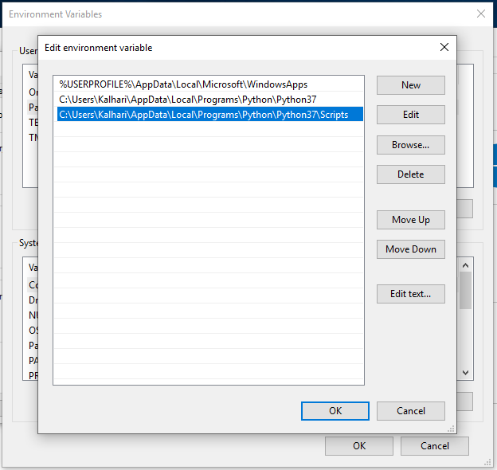
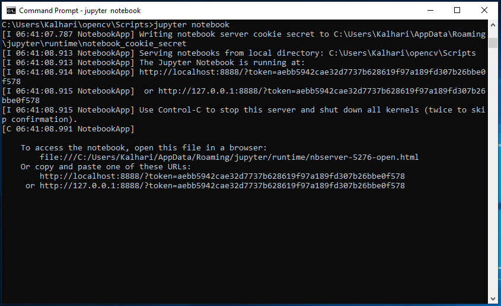
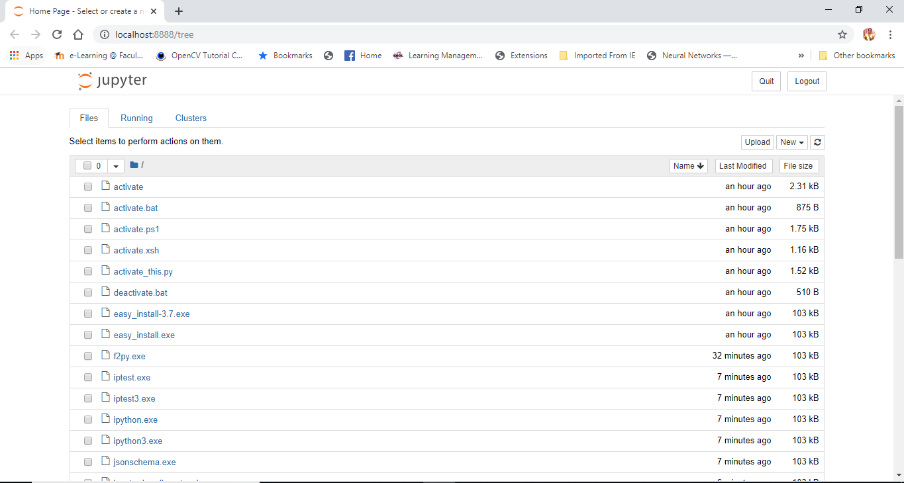

=======================
Windows
=======================

If you have not installed Python on Windows please follow this guide

Install Windows Python
======================

Install Python from this URL: 
`Python <https://www.python.org/downloads/windows/>`__

Please use at least Python 3.7 or higher

Choose and select “x86–64 executable installer” for Windows 10–64 bit computer

.. image:: image/1_qExP_ms_ykdWn8sFqSS_nA.png

Set “Python37” path and “Python37/Scripts” path to environment variable

.. image:: image/1_oWbXAMFsDz-z67wk7HiLrA.png

PIP
==========

pip is a de facto standard package-management system used to install and manage software packages written in Python.
Many packages can be found in the default source for packages and their dependencies — Python Package Index (PyPI)

.. code-block:: bash

    pip install inforion

 code . . .

Upgrade
=======

If you want to upgrade the inforion please use 

.. code-block:: bash

    pip install inforion --upgrade

 code . . .

Show Version
============

Show the version you have installed please use

.. code-block:: bash

    pip show inforion 

 code . . .

Jupyter Notebook to Windows 10
==============================

Install Jupyter using “python -m pip install jupyter”

.. image:: image/1_US6AcX4AHQ9czzf5oJHfxg.png

Run Jupyter Notebook using “jupyter notebook”

Start the notebook server and popup dashboard in browser using “localhost:8888/tree” url

