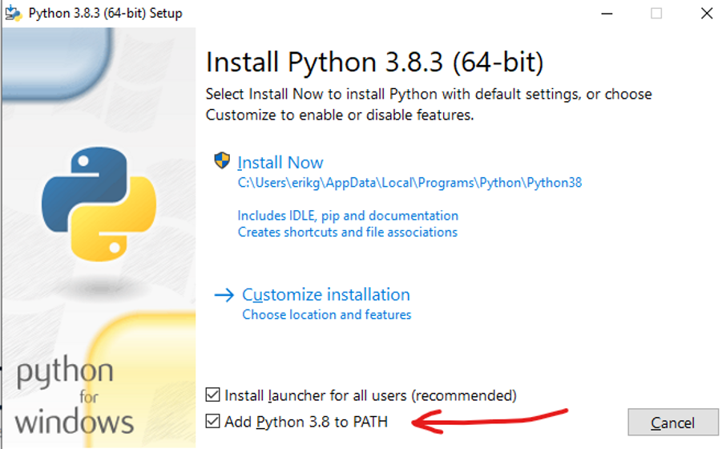

=======================
Windows
=======================

If you have not installed Python on Windows please follow this guide

Python 3 Installer Download
---------------------------

1. Install Python from this URL: 
`Python <https://www.python.org/downloads/windows/>`__

    1.1 Please use at least Python 3.7 or higher

2. Choose and select **x86–64 executable installer** for Windows 10–64 bit computer or **Windows x86 executable installer** for 32-bit

.. image:: image/1_qExP_ms_ykdWn8sFqSS_nA.png

Run the Installer
-----------------

Once you have downloaded an installer, simply run it by double-clicking on the downloaded file. A pop-up window should appear that looks like following:

3. Prior installing Python, please select the option: **Add Python 3.8 to PATH**

4. After Setup was successful select: **Disable path length limit**

.. image:: image/python1.png

PIP
=====

Pip is a de facto standard package-management system used to install and manage software packages written in Python.
Many packages can be found in the default source for packages and their dependencies — Python Package Index (PyPI).

Installation
------------

.. code-block:: bash

    pip install inforion

 code . . .

Upgrade
-------

If you want to upgrade the inforion, please use:

.. code-block:: bash

    pip install inforion --upgrade

 code . . .

Show Version
------------

If you want to see the version you have installed, please use:

.. code-block:: bash

    pip show inforion 

 code . . .

==============================
Jupyter Notebook to Windows 10
==============================

Install Jupyter using **python -m pip install jupyter**

.. image:: image/1_US6AcX4AHQ9czzf5oJHfxg.png

Run Jupyter Notebook using **jupyter notebook**

.. image:: image/1_CcrLTITT6NXte-Mgqh1AaQ.png

Start the notebook server and popup dashboard in browser using “localhost:8888/tree” url

.. image:: image/1_VNqiduT87Z-T-k70m12yCQ.png

